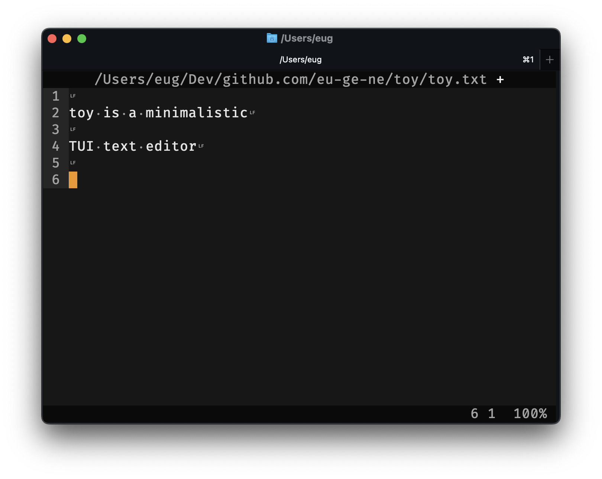

# toy

Minimalistic TUI text editor. Built with Deno and TypeScript with zero
third-party dependencies.



- [Installation](#installation)
  - [Homebrew (macOS only)](#homebrew-macos-only)
- [Features](#features)
  - [Text](#text)
  - [Rendering](#rendering)
  - [Input](#input)
  - [UX](#ux)
- [Supported terminal emulators](#supported-terminal-emulators)
- [Keyboard shortcuts](#keyboard-shortcuts)
  - [Function](#function)
  - [Navigate](#navigate)
  - [Select](#select)
  - [Edit](#edit)
- [Roadmap](#roadmap)
- [License](#license)

## Installation

### Homebrew (macOS only)

Install from a tap (Third-Party Repository):

```bash
brew install eu-ge-ne/tap/toy
```

## Features

### Text

- Working with large files (tested on gigabyte-sized files)
- Working with text as a sequence of Unicode grapheme clusters
- Moving cursor according to the width of characters rendered by terminal
  emulators

### Rendering

- 256-color palette
- Rendering whitespace characters
- Leveraging the
  [Synchronized Output](https://gist.github.com/christianparpart/d8a62cc1ab659194337d73e399004036)
  extension for fast rendering (median 5 ms)

### Input

- [Kitty keyboard protocol](https://sw.kovidgoyal.net/kitty/keyboard-protocol)
  support
- Integration with the system clipboard via OSC52

### UX

- Command Palette
- Zen mode
- Undo/Redo buffer
- Line wrapping

## Supported terminal emulators

- kitty
- Ghostty
- VSCode terminal

## Keyboard shortcuts

### Function

- `F1` - Open Command Palette
- `F2` - Save
- `F5` - Toggle invisible characters
- `F6` - Toggle line wrapping
- `F9` - Toggle debug panel
- `F10` - Exit
- `F11` - Toggle Zen mode

### Navigate

- `Left`, `Right`, `Up`, `Down` - Move cursor
- `Home` - Move cursor to beginning of current line (`Fn+Left`, `⌘+Left`)
- `End` - Move cursor to end of current line (`Fn+Right`, `⌘+Right`)
- `Page Up` - Move cursor up a frame (`Fn+Up`)
- `Page Down` - Move cursor down a frame (`Fn+Down`)
- `⌘+Up` - Move cursor to the top of the text
- `⌘+Down` - Move cursor to the bottom of the text

### Select

- `⇧+Left` - Extend text selection one character to the left
- `⇧+Right` - Extend text selection one character to the right
- `⇧+Up` - Extend text selection to the nearest character at the same horizontal
  location on the line above
- `⇧+Down` - Extend text selection to the nearest character at the same
  horizontal location on the line below
- `⇧+Home` - Select the text between the cursor and the beginning of the current
  line (`⇧+Fn+Left`, `⇧+⌘+Left`)
- `⇧+End` - Select the text between the cursor and the end of the current line
  (`⇧+Fn+Right`, `⇧+⌘+Right`)
- `⇧+Page Up` - Select a frame of text above the cursor (`⇧+Fn+Up`)
- `⇧+Page Down` - Select a frame of text below the cursor (`⇧+Fn+Down`)
- `⇧+⌘+Up` - Select the text between the cursor and the beginning of the text
- `⇧+⌘+Down` - Select the text between the cursor and the end of the text
- `⌃+A` - Select all text (`⌘+A`)

### Edit

- `⌃+Z` - Undo (`⌘+Z`)
- `⌃+Y` - Redo (`⌘+Y`)
- `⌃+C` - Copy selected text (`⌘+C`)
- ️`⌃+X` - Cut selected text (`⌘+X`)
- `⌃+V` - Paste text at cursor (`⌘+V`)
- `Delete` - Delete the character to the left of the cursor
- `Fn+Delete` - Delete the character under the cursor

## Roadmap

- `⌃+F` - Find
- `F3` - Find next
- `⇧+F3` - Find previous
- Mouse support

## License

[MIT](https://choosealicense.com/licenses/mit)
